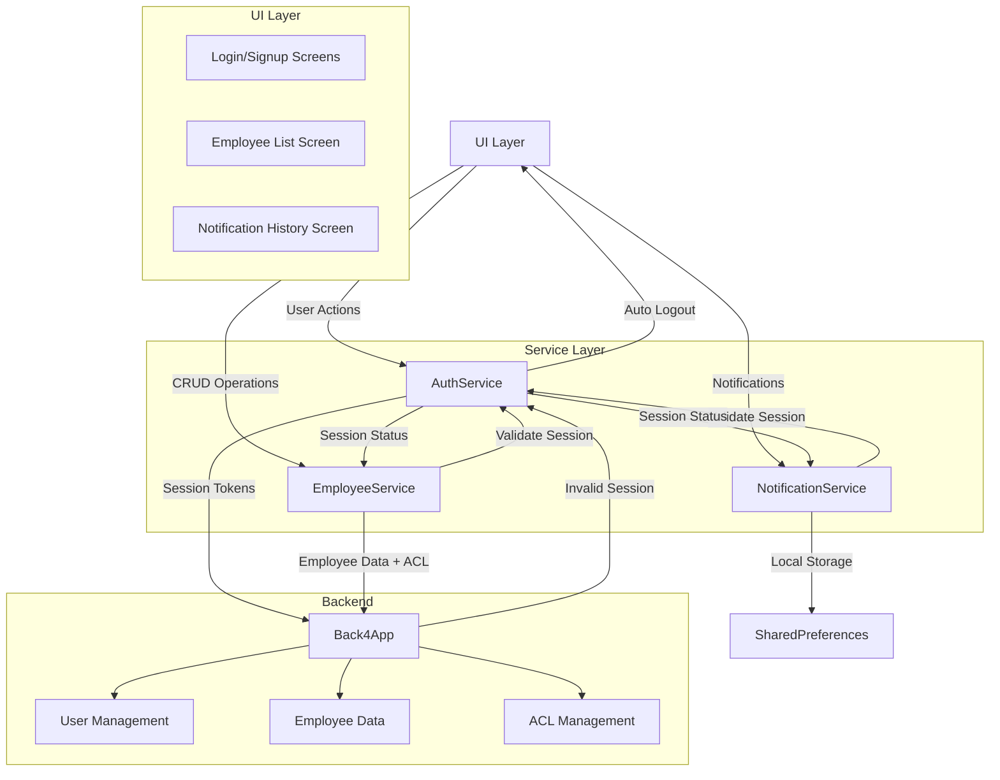

# Flutter Employee Management App

A Flutter application demonstrating CRUD operations using Back4App as the backend.

# Assignment document
[https://github.com/vissharm/assignement_flutter_cpad/blob/master/CrossPlatformAssignmentFinal.pdf](https://github.com/vissharm/assignement_flutter_cpad/blob/master/CrossPlatformAssignmentFinal.pdf)
### Note:  Do click "more pages" again and again at the bottom of page to see all pages of slide document.

# FOR COURSE STUDENTS: CAUTION: REPO IS MADE PUBLIC FOR EVALUATION, SO DO NOT COPY, ALREADY SUBMITTED AND SENT TO PROFESSOR. FEEL FREE TO LEARN FROM IT AND APPLY CONCEPTS. ALWAYS APPRECIATE KNOWLEDGE SHARING.

# Demo recording
https://youtu.be/RZABm8SFpk4

## Features

1. **Authentication**
   - User signup and login using Back4App's Parse SDK
   - Session management handled by Parse SDK
   - Auto-logout on session expiration

2. **Employee Management**
   - Create, Read, Update, Delete (CRUD) operations
   - List view with employee details
   - Form validation
   - **(Note: Confirmation dialogs for delete operations are not implemented)**

3. **Notification System**
   - Basic notification display for CRUD operations
   - Notification history with timestamps using `timeago` package
   - Notification count badge
   - 24-hour notification display filter
   - Local storage using `SharedPreferences`
  
## Screenshots


## Development Steps

1. Create a new Flutter project:
```bash
flutter create assignement_flutter_cpad
cd assignement_flutter_cpad
```

2. Add required dependencies in `pubspec.yaml`:
```yaml
dependencies:
  flutter:
    sdk: flutter
  parse_server_sdk_flutter: ^7.0.0
  crypto: ^3.0.3
  shared_preferences: ^2.2.0
  timeago: ^3.5.0
```

3. Install dependencies:
```bash
flutter pub get
```

4. Back4App Setup:
   - Create an account on [Back4App](https://www.back4app.com/)
   - Create a new app
   - Get Application ID and Client Key from Security & Keys
   - Create "Employee" class with columns:
     - `name` (String)
     - `email` (String)
     - `position` (String)
     - `salary` (Number)
   - Create "User" class (automatically created by Back4App)
     - `username` (String)
     - `password` (String)
     - `email` (String)

5. Configure Back4App credentials:
   Create `lib/config/back4app_config.dart`:
```dart
class Back4AppConfig {
  static const String applicationId = 'YOUR_APP_ID';
  static const String clientKey = 'YOUR_CLIENT_KEY';
  static const String serverUrl = 'https://parseapi.back4app.com';
}
```

## Project Structure

### Directory Organization

```
lib/
├── config/
│   ├── back4app_config.dart    # Back4App credentials and configuration
│   └── app_config.dart         # Application-wide configuration
├── models/
│   ├── employee.dart           # Employee data model
│   └── notification_item.dart  # Notification data model
├── services/
│   ├── auth_service.dart       # Authentication handling
│   ├── employee_service.dart   # Employee CRUD operations
│   └── notification_service.dart # Notification management
├── screens/
│   ├── auth/
│   │   ├── login_screen.dart   # Login screen
│   │   └── signup_screen.dart  # Signup screen
│   ├── employee/
│   │   ├── employee_list_screen.dart  # Employee listing
│   │   └── employee_form_screen.dart  # Add/Edit employee
│   └── notification/
│       └── notification_history_screen.dart # Notification history
├── widgets/
│   ├── common/
│   │   ├── loading_indicator.dart
│   │   └── error_dialog.dart
│   ├── employee/
│   │   ├── employee_card.dart
│   │   └── employee_list_item.dart
│   └── notification/
│       ├── notification_badge.dart
│       └── notification_item_widget.dart
└── main.dart                   # Application entry point
```

### Data Models

1. **Employee Model**
```dart
class Employee {
  final String id;
  final String name;
  final String email;
  final String position;
  final double salary;
  
  // Constructor and methods
}
```

2. **Notification Model**
```dart
class NotificationItem {
  final String message;
  final NotificationType type;
  final DateTime timestamp;
  final bool isRead;
  
  // Constructor and methods
}
```

### Service Layer

1. **Authentication Service**
```dart
class AuthService {
  Future<User> login(String username, String password);
  Future<User> signup(String username, String password, String email);
  Future<void> logout();
  bool isAuthenticated();
}
```

2. **Employee Service**
```dart
class EmployeeService {
  Future<List<Employee>> getEmployees();
  Future<Employee> getEmployee(String id);
  Future<Employee> createEmployee(Employee employee);
  Future<Employee> updateEmployee(Employee employee);
  Future<void> deleteEmployee(String id);
}
```

3. **Notification Service**
```dart
class NotificationService {
  Future<void> addNotification(NotificationItem notification);
  Future<List<NotificationItem>> getNotifications();
  Future<void> markAsRead(String notificationId);
  Future<void> clearOldNotifications();
}
```

---

## Technical Architecture

### Updated Data Flow Diagram



---

## Testing

1. **Unit Tests**
   - **(Note: Unit tests are not implemented in the codebase)**

2. **Widget Tests**
   - **(Note: Widget tests are not implemented in the codebase)**

3. **Integration Tests**
   - **(Note: Integration tests are not implemented in the codebase)**

---

## Contributing

1. Fork the repository.
2. Create your feature branch.
3. Commit your changes.
4. Push to the branch.
5. Create a Pull Request.

---

## License

This project is licensed under the MIT License - see the LICENSE file for details.

## Authentication Implementation

Authentication is handled entirely through Back4App's Parse Server SDK:

1. **User Authentication**
```dart
// lib/services/auth_service.dart
Future<ParseResponse> login(String email, String password) async {
  try {
    final user = ParseUser(email, password, email);
    final response = await user.login();
    return response;
  } catch (e) {
    print('Login exception: $e');
    final response = ParseResponse();
    response.error = ParseError(
      code: -1,
      message: 'Login failed: ${e.toString()}',
    );
    return response;
  }
}
```

2. **Session Management**
```dart
// lib/services/auth_service.dart
Future<bool> isLoggedIn() async {
  try {
    final user = await ParseUser.currentUser();
    if (user != null) {
      //Validate session token
      final response = await ParseUser.getCurrentUserFromServer(user.sessionToken);
      if (response != null) {
        return response.success;
      }
    }
    return false;
  } catch (e) {
    return false;
  }
}
```

3. **User Registration**
```dart
// lib/services/auth_service.dart
Future<ParseResponse> signUp(String email, String password) async {
  final user = HRUser(
    username: email,
    password: password.trim(),
    emailAddress: email,
  );
  return await user.signUp();
}
```

4. **Logout Handling**
```dart
// lib/services/auth_service.dart
Future<bool> logout() async {
  try {
    final user = await ParseUser.currentUser();
    if (user != null) {
      await user.logout();
      return true;
    }
    return false;
  } catch (e) {
    throw Exception('Logout failed: $e');
  }
}
```

### Security Features

The application leverages Back4App's built-in security features through Parse SDK:

1. **Password Security**
   - Passwords are securely handled by Parse SDK
   - No local password storage or manipulation
   - Secure transmission over HTTPS

2. **Session Management**
   - Automatic session token generation and validation
   - Server-side session expiration
   - Secure token storage
   - Auto-logout on invalid sessions

3. **Error Handling**
```dart
// lib/screens/login_screen.dart
if (response.error != null) {
  switch (response.error!.code) {
    case 101: // Invalid username/password
      errorMessage = 'Invalid email or password';
      break;
    case 205: // Email not verified
      errorMessage = 'Please verify your email first';
      break;
    case -1: // Network error
      errorMessage = 'Network error. Please check your connection';
      break;
    default:
      errorMessage = response.error!.message ?? 'Login failed';
  }
}
```

### Parse SDK Integration

The Parse SDK is initialized in the application's entry point:

```dart
// lib/main.dart
await Parse().initialize(
  Back4AppConfig.applicationId,
  Back4AppConfig.serverUrl,
  clientKey: Back4AppConfig.clientKey,
  debug: true,
);
```

Configuration is managed through:
```dart
// lib/config/back4app_config.dart
class Back4AppConfig {
  static const String applicationId = 'YOUR_APP_ID';
  static const String clientKey = 'YOUR_CLIENT_KEY';
  static const String serverUrl = 'https://parseapi.back4app.com';
}
```

## Screens and Features

### 1. Authentication Screens

#### Login Screen (`lib/screens/login_screen.dart`)
- Email and password authentication
- Form validation:
```dart
TextFormField(
  controller: _emailController,
  decoration: InputDecoration(
    labelText: 'Email',
    prefixIcon: const Icon(Icons.email),
    border: OutlineInputBorder(
      borderRadius: BorderRadius.circular(12),
    ),
  ),
  validator: (value) {
    if (value == null || value.isEmpty) {
      return 'Please enter your email';
    }
    return null;
  },
)
```
- Loading state handling during authentication
- Error message display
- Navigation to signup screen
- Successful login redirects to Employee List Screen

#### Signup Screen (`lib/screens/signup_screen.dart`)
- User registration form
- Form validation for:
  - Email format
  - Password requirements
- Success/Error notifications
```dart
Future<void> _signup() async {
  if (_formKey.currentState!.validate()) {
    setState(() => _isLoading = true);
    try {
      final response = await _authService.signUp(
        _emailController.text.trim(),
        _passwordController.text.trim(),
      );

      if (response.success && mounted) {
        Navigator.pop(context);
        ScaffoldMessenger.of(context).showSnackBar(
          const SnackBar(
            content: Text('Account created successfully! Please login.'),
            backgroundColor: Colors.green,
          ),
        );
      }
    } finally {
      if (mounted) {
        setState(() => _isLoading = false);
      }
    }
  }
}
```

### 2. Employee Management Screens

#### Employee List Screen (`lib/screens/employee_list_screen.dart`)
- Displays list of employees
- Add/Edit/Delete operations
- Navigation to employee form
- Notification badge for system notifications
```dart
Future<void> _showEmployeeForm({Employee? employee}) async {
  final result = await Navigator.push(
    context,
    MaterialPageRoute(
      builder: (context) => EmployeeFormScreen(employee: employee),
    ),
  );

  if (result == true) {
    await _loadEmployees();
    if (mounted) {
      NotificationService.showNotification(
        context,
        message: employee == null 
            ? 'Employee added successfully'
            : 'Employee updated successfully',
      );
    }
  }
}
```

#### Employee Form Screen (`lib/screens/employee_form_screen.dart`)
- Add/Edit employee details
- Form validation for:
  - Name (required)
  - Email (format validation)
  - Position (required)
  - Salary (numeric validation)
- Success/Error notifications

### 3. Notification System

#### Notification History Screen (`lib/screens/notification_history_screen.dart`)
- Lists all system notifications
- Timestamp display using `timeago` package
- 24-hour filter for notifications
- Read/Unread status
- Clear notification functionality

## Data Models

### Employee Model
```dart
class Employee {
  final String id;
  final String name;
  final String email;
  final String position;
  final double salary;
  
  // Constructor and methods
}
```

### Notification Model
```dart
class NotificationItem {
  final String message;
  final NotificationType type;
  final DateTime timestamp;
  final bool isRead;
  
  // Constructor and methods
}
```

## Service Layer

### Authentication Service
- Handles user authentication through Parse SDK
- Session management
- Login/Signup operations
- Error handling

### Employee Service
- CRUD operations for employees
- Data validation
- Error handling
- Back4App integration

### Notification Service
- Notification management
- Local storage using SharedPreferences
- Notification filtering
- Read status management

## Error Handling

### Form Validation
- Required field validation
- Email format validation
- Numeric field validation
- Custom error messages

### API Error Handling
- Network error detection
- Parse SDK error handling
- User-friendly error messages
- Session expiration handling

## UI Components

### Common Widgets
- Loading indicators
- Error dialogs
- Form fields with validation
- Notification badges

### Employee Widgets
- Employee list items
- Employee form fields
- Action buttons (Edit/Delete)

### Notification Widgets
- Notification badge with count
- Notification list items
- Timestamp display


