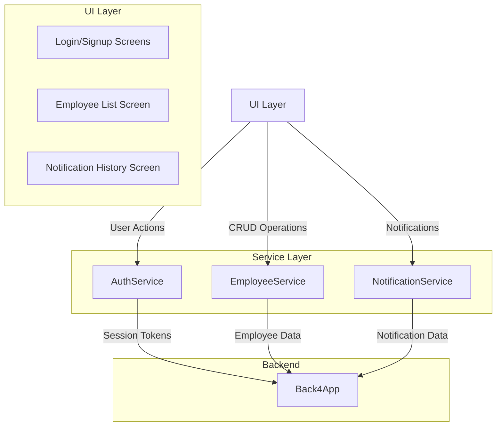

# Flutter Employee Management App

A Flutter application demonstrating CRUD operations using Back4App as the backend.

## Features

1. **Authentication**
   - User signup and login using Back4App's Parse SDK
   - Session management handled by Parse SDK
   - Auto-logout on session expiration

2. **Employee Management**
   - Create, Read, Update, Delete (CRUD) operations
   - List view with employee details
   - Form validation
   - **(Note: Confirmation dialogs for delete operations are not implemented)**

3. **Notification System**
   - Basic notification display for CRUD operations
   - Notification history with timestamps using `timeago` package
   - Notification count badge
   - 24-hour notification display filter
   - Local storage using `SharedPreferences`

## Development Steps

1. Create a new Flutter project:
```bash
flutter create assignement_flutter_cpad
cd assignement_flutter_cpad
```

2. Add required dependencies in `pubspec.yaml`:
```yaml
dependencies:
  flutter:
    sdk: flutter
  parse_server_sdk_flutter: ^7.0.0
  crypto: ^3.0.3
  shared_preferences: ^2.2.0
  timeago: ^3.5.0
```

3. Install dependencies:
```bash
flutter pub get
```

4. Back4App Setup:
   - Create an account on [Back4App](https://www.back4app.com/)
   - Create a new app
   - Get Application ID and Client Key from Security & Keys
   - Create "Employee" class with columns:
     - `name` (String)
     - `email` (String)
     - `position` (String)
     - `salary` (Number)
   - Create "User" class (automatically created by Back4App)
     - `username` (String)
     - `password` (String)
     - `email` (String)

5. Configure Back4App credentials:
   Create `lib/config/back4app_config.dart`:
```dart
class Back4AppConfig {
  static const String applicationId = 'YOUR_APP_ID';
  static const String clientKey = 'YOUR_CLIENT_KEY';
  static const String serverUrl = 'https://parseapi.back4app.com';
}
```

## Project Structure

### Directory Organization

```
lib/
├── config/
│   ├── back4app_config.dart    # Back4App credentials and configuration
│   └── app_config.dart         # Application-wide configuration
├── models/
│   ├── employee.dart           # Employee data model
│   └── notification_item.dart  # Notification data model
├── services/
│   ├── auth_service.dart       # Authentication handling
│   ├── employee_service.dart   # Employee CRUD operations
│   └── notification_service.dart # Notification management
├── screens/
│   ├── auth/
│   │   ├── login_screen.dart   # Login screen
│   │   └── signup_screen.dart  # Signup screen
│   ├── employee/
│   │   ├── employee_list_screen.dart  # Employee listing
│   │   └── employee_form_screen.dart  # Add/Edit employee
│   └── notification/
│       └── notification_history_screen.dart # Notification history
├── widgets/
│   ├── common/
│   │   ├── loading_indicator.dart
│   │   └── error_dialog.dart
│   ├── employee/
│   │   ├── employee_card.dart
│   │   └── employee_list_item.dart
│   └── notification/
│       ├── notification_badge.dart
│       └── notification_item_widget.dart
└── main.dart                   # Application entry point
```

### Data Models

1. **Employee Model**
```dart
class Employee {
  final String id;
  final String name;
  final String email;
  final String position;
  final double salary;
  
  // Constructor and methods
}
```

2. **Notification Model**
```dart
class NotificationItem {
  final String message;
  final NotificationType type;
  final DateTime timestamp;
  final bool isRead;
  
  // Constructor and methods
}
```

### Service Layer

1. **Authentication Service**
```dart
class AuthService {
  Future<User> login(String username, String password);
  Future<User> signup(String username, String password, String email);
  Future<void> logout();
  bool isAuthenticated();
}
```

2. **Employee Service**
```dart
class EmployeeService {
  Future<List<Employee>> getEmployees();
  Future<Employee> getEmployee(String id);
  Future<Employee> createEmployee(Employee employee);
  Future<Employee> updateEmployee(Employee employee);
  Future<void> deleteEmployee(String id);
}
```

3. **Notification Service**
```dart
class NotificationService {
  Future<void> addNotification(NotificationItem notification);
  Future<List<NotificationItem>> getNotifications();
  Future<void> markAsRead(String notificationId);
  Future<void> clearOldNotifications();
}
```

---

## Technical Architecture

### Updated Data Flow Diagram



---

## Testing

1. **Unit Tests**
   - **(Note: Unit tests are not implemented in the codebase)**

2. **Widget Tests**
   - **(Note: Widget tests are not implemented in the codebase)**

3. **Integration Tests**
   - **(Note: Integration tests are not implemented in the codebase)**

---

## Known Issues

1. **Confirmation dialogs for delete operations**: Not implemented.
2. **State management**: The `README.md` mentions `Provider`, but it is not used in the codebase. State is managed locally within widgets.
3. **Testing**: No tests (unit, widget, or integration) are present in the codebase.

---

## Contributing

1. Fork the repository.
2. Create your feature branch.
3. Commit your changes.
4. Push to the branch.
5. Create a Pull Request.

---

## License

This project is licensed under the MIT License - see the LICENSE file for details.
