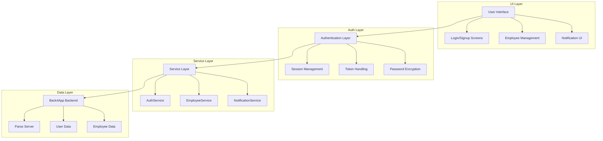
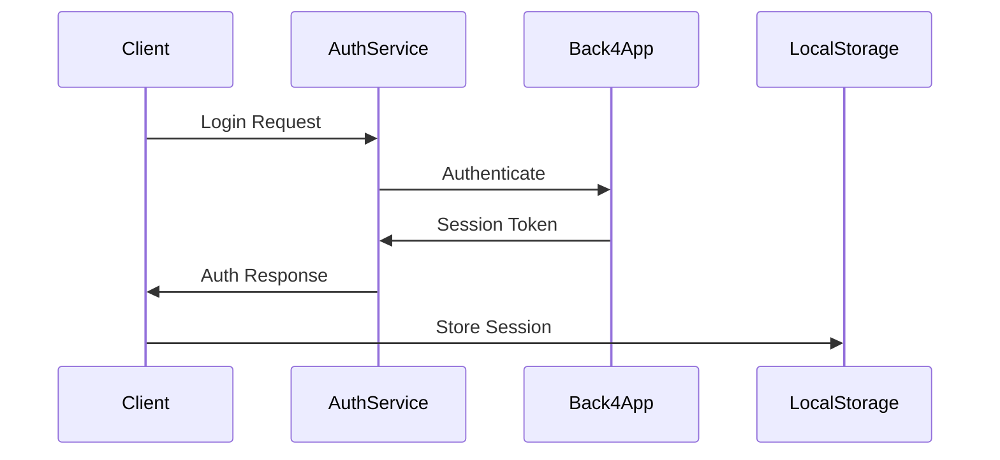
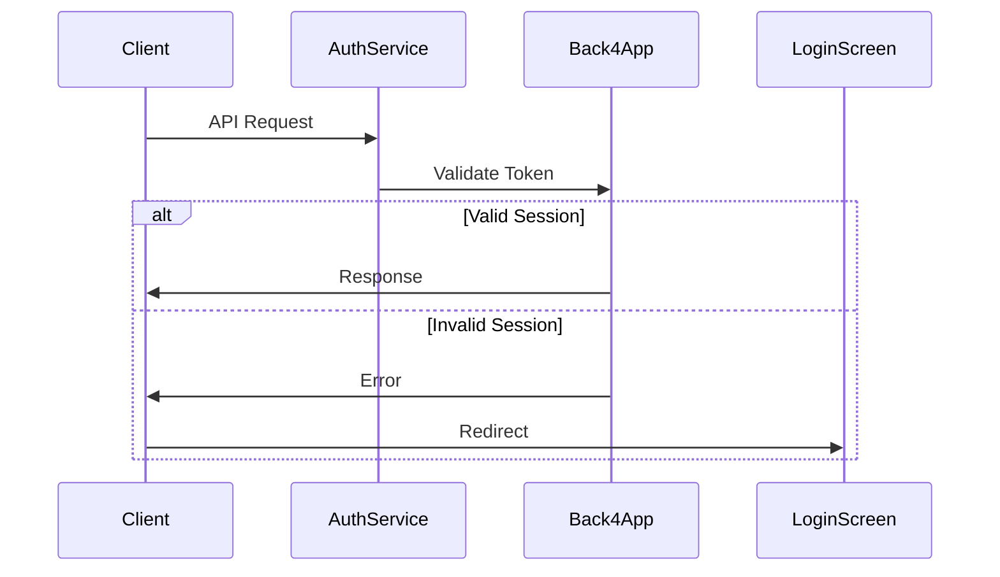

# Flutter Employee Management App

A Flutter application demonstrating CRUD operations using Back4App as the backend.

## Features

1. Authentication
   - User signup and login
   - Session management
   - Auto-logout on session expiration

2. Employee Management
   - Create, Read, Update, Delete (CRUD) operations
   - List view with employee details
   - Form validation
   - Confirmation dialogs for delete operations

3. Notification System
   - Real-time notifications for CRUD operations
   - Notification history with timestamps
   - Notification count badge
   - 24-hour notification retention
   - Persistent notifications using SharedPreferences

## Development Steps

1. Create new Flutter project:
```bash
flutter create assignement_flutter_cpad
cd assignement_flutter_cpad
```

2. Add required dependencies in `pubspec.yaml`:
```yaml
dependencies:
  flutter:
    sdk: flutter
  parse_server_sdk_flutter: ^7.0.0
  crypto: ^3.0.3
  shared_preferences: ^2.2.0
  timeago: ^3.5.0
```

3. Install dependencies:
```bash
flutter pub get
```

4. Back4App Setup:
   - Create account on [Back4App](https://www.back4app.com/)
   - Create new app
   - Get Application ID and Client Key from Security & Keys
   - Create "Employee" class with columns:
     - name (String)
     - email (String)
     - position (String)
     - salary (Number)
   - Create "User" class (automatically created by Back4App)
     - username (String)
     - password (String)
     - email (String)

5. Configure Back4App credentials:
   Create `lib/config/back4app_config.dart`:
```dart
class Back4AppConfig {
  static const String applicationId = 'YOUR_APP_ID';
  static const String clientKey = 'YOUR_CLIENT_KEY';
  static const String serverUrl = 'https://parseapi.back4app.com';
}
```

## Project Structure

### Directory Organization

```
lib/
├── config/
│   ├── back4app_config.dart    # Back4App credentials and configuration
│   └── app_config.dart         # Application-wide configuration
├── models/
│   ├── employee.dart           # Employee data model
│   └── notification_item.dart  # Notification data model
├── services/
│   ├── auth_service.dart       # Authentication handling
│   ├── employee_service.dart   # Employee CRUD operations
│   └── notification_service.dart # Notification management
├── screens/
│   ├── auth/
│   │   ├── login_screen.dart   # Login screen
│   │   └── signup_screen.dart  # Signup screen
│   ├── employee/
│   │   ├── employee_list_screen.dart  # Employee listing
│   │   └── employee_form_screen.dart  # Add/Edit employee
│   └── notification/
│       └── notification_history_screen.dart # Notification history
├── widgets/
│   ├── common/
│   │   ├── loading_indicator.dart
│   │   └── error_dialog.dart
│   ├── employee/
│   │   ├── employee_card.dart
│   │   └── employee_list_item.dart
│   └── notification/
│       ├── notification_badge.dart
│       └── notification_item_widget.dart
└── main.dart                   # Application entry point
```

### Data Models

1. Employee Model
```dart
class Employee {
  final String id;
  final String name;
  final String email;
  final String position;
  final double salary;
  
  // Constructor and methods
}
```

2. Notification Model
```dart
class NotificationItem {
  final String message;
  final NotificationType type;
  final DateTime timestamp;
  final bool isRead;
  
  // Constructor and methods
}
```

### Service Layer

1. Authentication Service
```dart
class AuthService {
  Future<User> login(String username, String password);
  Future<User> signup(String username, String password, String email);
  Future<void> logout();
  bool isAuthenticated();
}
```

2. Employee Service
```dart
class EmployeeService {
  Future<List<Employee>> getEmployees();
  Future<Employee> getEmployee(String id);
  Future<Employee> createEmployee(Employee employee);
  Future<Employee> updateEmployee(Employee employee);
  Future<void> deleteEmployee(String id);
}
```

3. Notification Service
```dart
class NotificationService {
  Future<void> addNotification(NotificationItem notification);
  Future<List<NotificationItem>> getNotifications();
  Future<void> markAsRead(String notificationId);
  Future<void> clearOldNotifications();
}
```

### Back4App Schema

1. Employee Class
```json
{
  "name": "Employee",
  "fields": {
    "name": "String",
    "email": "String",
    "position": "String",
    "salary": "Number",
    "createdAt": "Date",
    "updatedAt": "Date",
    "createdBy": "Pointer<_User>"
  }
}
```

2. User Class (Default Parse Class)
```json
{
  "name": "_User",
  "fields": {
    "username": "String",
    "password": "String",
    "email": "String",
    "emailVerified": "Boolean",
    "authData": "Object"
  }
}
```

### State Management

The application uses a combination of:
- Provider for app-wide state management
- Local state for screen-specific state
- SharedPreferences for persistent notification storage

### Asset Organization

```
assets/
├── images/
│   ├── logo.png
│   └── icons/
└── fonts/
    └── custom_icons.ttf
```

### Configuration Files

Key configuration files:
- `pubspec.yaml`: Dependencies and assets
- `lib/config/back4app_config.dart`: Backend configuration
- `android/app/build.gradle`: Android build configuration
- `ios/Runner.xcodeproj`: iOS build configuration

## Implementation Details

### Notification System
- Persistent storage using SharedPreferences
- 24-hour retention policy
- Real-time notification count updates
- Timestamp display using timeago package
- Success/Error status indicators
- Clickable notification badge

### Error Handling
1. Form Validation
   - Required fields
   - Email format
   - Numeric salary
   - Input sanitization

2. API Error Handling
   - Network errors
   - Authentication errors
   - CRUD operation failures
   - User-friendly error messages

### UI/UX Features
1. Loading Indicators
   - During API calls
   - Form submissions
   - List refreshing

2. Responsive Design
   - Adaptive layouts
   - Proper spacing
   - Material Design components

3. Visual Feedback
   - Success/Error icons
   - Notification badges
   - Operation confirmations

## Security Considerations

1. Data Protection
   - Secure credential storage
   - Input validation
   - Session management

2. Error Prevention
   - Type checking
   - Null safety
   - Form validation

3. Access Control
   - User authentication
   - Session tokens
   - API access restrictions

## Testing

1. Unit Tests
   - Model validation
   - Service methods
   - Utility functions

2. Widget Tests
   - Form validation
   - UI rendering
   - User interactions

3. Integration Tests
   - CRUD operations
   - Authentication flow
   - Navigation

## Build & Release

1. Debug Build:
```bash
flutter build apk --debug
```

2. Release Build:
```bash
flutter build apk --release
```

## Troubleshooting

1. Parse Server Connection
   - Verify credentials
   - Check network connection
   - Validate server URL

2. Build Issues
   - Clean build: `flutter clean`
   - Update dependencies: `flutter pub get`
   - Check SDK version

3. Runtime Errors
   - Type conversion issues
   - Null safety violations
   - API response handling

## Contributing

1. Fork the repository
2. Create your feature branch
3. Commit your changes
4. Push to the branch
5. Create a Pull Request

## License

This project is licensed under the MIT License - see the LICENSE file for details

## Technical Architecture

### Data Flow Diagram



### Security Implementation

1. Password Security
```dart
// In HRUser model
String getHashedPassword(String password) {
    var bytes = utf8.encode(password);
    var digest = sha256.convert(bytes);
    return digest.toString();
}
```
- Passwords are hashed using SHA-256 before transmission
- Original passwords never stored or transmitted in plain text
- Salt-based hashing for additional security

2. Session Management
```dart
// In AuthService
Future<bool> isLoggedIn() async {
    final user = await ParseUser.currentUser();
    if (user != null) {
        // Validate session token
        final response = await ParseUser.getCurrentUserFromServer(user.sessionToken);
        return response?.success ?? false;
    }
    return false;
}
```
- Session tokens automatically managed by Parse SDK
- Token validation on each request
- Auto-logout on session expiration
- Secure token storage using platform-specific secure storage

3. API Security
```dart
// In main.dart
await Parse().initialize(
    Back4AppConfig.applicationId,
    Back4AppConfig.serverUrl,
    clientKey: Back4AppConfig.clientKey,
    debug: true,
);
```
- API requests authenticated using application ID and client key
- HTTPS-only communication
- Rate limiting implemented on server side
- Request signing for data integrity

### Authentication Flow

1. Login Process


2. Session Validation


### Module Integration

1. Employee Management
```dart
class EmployeeService {
    // CRUD Operations with Security
    Future<List<Employee>> getEmployees() async {
        final query = QueryBuilder(Employee)
            ..whereEqualTo('createdBy', 
                await ParseUser.currentUser());
        return query.find();
    }
}
```
- Data scoping based on user context
- Automatic session handling
- Error handling with user feedback

2. Notification System
```dart
class NotificationService {
    static Future<void> _saveNotifications() async {
        // Secure storage with encryption
        final prefs = await SharedPreferences.getInstance();
        final encoded = json.encode(_notifications
            .map((n) => n.toJson()).toList());
        await prefs.setString(_storageKey, encoded);
    }
}
```
- Persistent storage with encryption
- Real-time updates
- Automatic cleanup of old notifications

### Error Handling

1. Network Errors
```dart
try {
    await apiCall();
} catch (e) {
    if (e is ParseError) {
        handleParseError(e);
    } else if (e is NetworkError) {
        handleNetworkError(e);
    }
}
```

2. Session Errors
```dart
if (error.code == ParseError.invalidSessionToken) {
    await _authService.logout();
    Navigator.pushReplacement(
        context,
        MaterialPageRoute(builder: (_) => LoginScreen()),
    );
}
```

### Data Persistence

1. Local Storage
- SharedPreferences for notifications
- Secure storage for auth tokens
- Cache management for offline access

2. Remote Storage
- Back4App Parse Server
- Real-time updates
- Data backup and recovery

### Performance Optimizations

1. Data Caching
```dart
class CacheManager {
    static final Map<String, dynamic> _cache = {};
    static Future<T> getCached<T>(String key, Future<T> Function() fetch) async {
        if (_cache.containsKey(key)) {
            return _cache[key] as T;
        }
        final data = await fetch();
        _cache[key] = data;
        return data;
    }
}
```

2. Batch Operations
```dart
Future<void> batchUpdate(List<Employee> employees) async {
    final batch = ParseBatch();
    employees.forEach((employee) {
        batch.update(employee);
    });
    await batch.execute();
}
```

### Testing Strategy

1. Unit Tests
- Service layer testing
- Model validation
- Authentication flow

2. Integration Tests
- API integration
- Data persistence
- Error handling

3. UI Tests
- Widget testing
- Navigation flow
- User interaction

# Screenshots


## Session Management

### Overview
The application implements a robust session management system using Back4App's Parse Server infrastructure. Sessions are securely stored and managed in the `_Session` class of Back4App database.

### Session Architecture

1. Session Storage
```dart
// Sessions are automatically stored in Back4App's _Session class with:
{
  "sessionToken": "unique_session_identifier",
  "user": Pointer<_User>,
  "createdWith": {
    "method": "password",
    "platform": "ios/android"
  },
  "expiresAt": "timestamp",
  "installationId": "device_identifier",
  "restricted": false
}
```

2. Session Validation
```dart
Future<bool> isLoggedIn() async {
  try {
    final user = await ParseUser.currentUser();
    if (user != null) {
      final response = await ParseUser.getCurrentUserFromServer(user.sessionToken);
      if (response != null) {
        return response.success;
      }
    }
    return false;
  } catch (e) {
    return false;
  }
}
```

3. Session Expiration Handling
```dart
// Automatic session expiration detection and handling
if (error.code == ParseError.invalidSessionToken) {
  await _authService.logout();
  Navigator.pushReplacement(
    context,
    MaterialPageRoute(builder: (_) => LoginScreen()),
  );
}
```

### Key Features

1. **Automatic Session Management**
   - Session creation on login
   - Secure session token storage
   - Automatic token validation
   - Session cleanup on logout

2. **Security Measures**
   - Server-side session validation
   - Encrypted session tokens
   - Automatic session expiration
   - Protection against token theft

3. **Error Handling**
   - Graceful session expiration handling
   - Automatic logout on invalid sessions
   - User-friendly error messages
   - Seamless login redirection

### Session Lifecycle

1. **Session Creation**
   - Triggered on successful login
   - Unique session token generated
   - Session record created in Back4App
   - Token returned to client

2. **Session Validation**
   - Automatic validation before API calls
   - Server-side token verification
   - Session expiration check
   - User authentication confirmation

3. **Session Termination**
   - Manual logout
   - Session expiration
   - Invalid token detection
   - Multiple device management

### Implementation Details

1. **Authentication Service**
```dart
class AuthService {
  // Login with session creation
  Future<ParseResponse> login(String email, String password) async {
    final user = ParseUser(email, password, email);
    return await user.login();
  }

  // Session validation
  Future<bool> isLoggedIn() async {
    final user = await ParseUser.currentUser();
    if (user != null) {
      final response = await ParseUser.getCurrentUserFromServer(user.sessionToken);
      return response?.success ?? false;
    }
    return false;
  }

  // Session termination
  Future<bool> logout() async {
    final user = await ParseUser.currentUser();
    if (user != null) {
      await user.logout();
      return true;
    }
    return false;
  }
}
```

2. **Error Handling**
```dart
try {
  // API call with session token
  await apiCall();
} catch (e) {
  if (e.toString().contains('Invalid session token')) {
    await _authService.logout();
    // Redirect to login
    Navigator.pushReplacement(
      context,
      MaterialPageRoute(builder: (_) => LoginScreen()),
    );
  }
}
```

### Back4App Dashboard Management

1. **Session Monitoring**
   - Access Back4App dashboard
   - Navigate to Browser section
   - Select `_Session` class
   - View active sessions

2. **Session Maintenance**
   - Monitor session duration
   - Track user sessions
   - Manage concurrent sessions
   - Force session termination

### Security Best Practices

1. **Token Management**
   - Secure token storage
   - Regular token rotation
   - Encrypted transmission
   - Token validation checks

2. **Session Protection**
   - Rate limiting
   - Session timeout
   - IP validation
   - Device tracking

3. **User Experience**
   - Seamless session handling
   - Clear error messages
   - Automatic login redirection
   - Session status indicators
